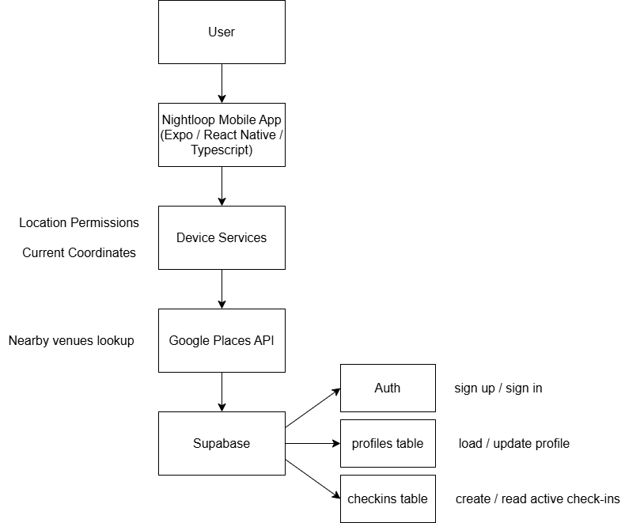

# Nightloop Portfolio

Nightloop is a mobile app project focused on location-aware venue discovery and social check-ins.

This repository is a public portfolio showcase for the project. It contains project overview material, architecture, screenshots, and selected non-sensitive code samples. The full production repository remains private.

## What it does

- Finds nearby venues based on the user’s location
- Supports user authentication and profile setup
- Lets users create and view active check-ins
- Uses a cloud backend for profile and check-in data

## Stack

- Expo
- React Native
- TypeScript
- Supabase
- Google Places API

## Architecture

## Selected code samples

- [VenueCard component](samples/VenueCard.tsx)
- [Location / nearby venues hook](samples/useNearbyVenues.ts)
- [Type definitions / helpers](samples/types.ts)

## Notes

This repository is intentionally limited to non-sensitive artifacts and representative code samples. Production source, secrets, and proprietary implementation details are not included.
